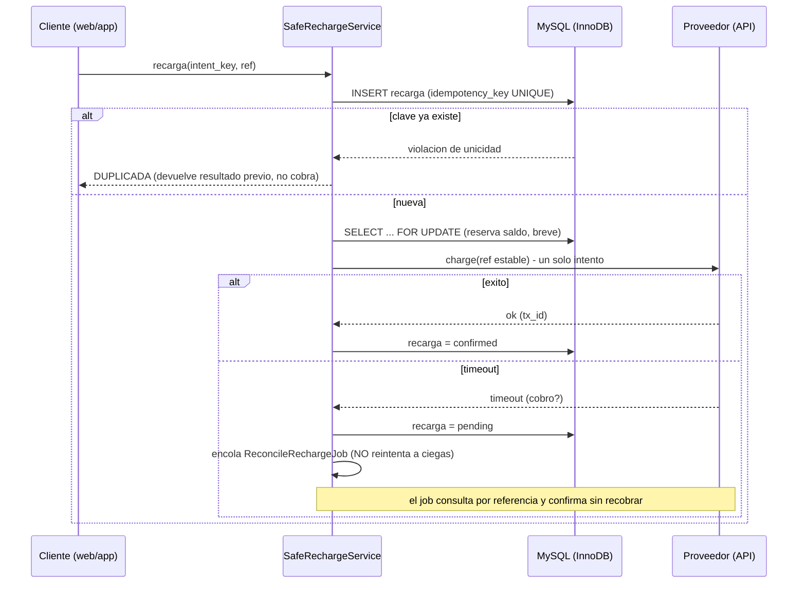

# RechargeCore — Laboratorio de concurrencia para recargas digitales

> Demostración **ejecutable** de cómo un sistema de recargas pierde dinero por
> condiciones de carrera, timeouts y duplicidad — y cómo se elimina esa pérdida
> con idempotencia, bloqueo de fila y reconciliación asíncrona.
>
> Todo corre con un comando y **mide la pérdida en dinero**, antes y después.

Este repositorio **no** contiene la plataforma de ningún tercero ni datos reales.
Es un laboratorio neutro que reproduce el **problema** (un saldo prepago
compartido, recargas por ID de jugador y una API externa con latencia y
timeouts) para poder demostrar la **solución** con números, no con promesas.

---

## 1. Qué demuestra (resultado real de una corrida)

Cada corrida lanza decenas de procesos concurrentes que compiten por el mismo
saldo y el mismo proveedor. Se ejecuta dos veces con la misma carga: la
implementación **ingenua** (lo que suele existir hoy) y la **segura**.

**Escenario A — doble cobro (duplicidad / timeout):**

| Métrica                | NAIVE          | SAFE          |
|------------------------|----------------|---------------|
| Solicitudes (clics)    | 238            | 242           |
| Compras reales         | 120            | 120           |
| Duplicadas rechazadas  | 0              | 122           |
| Cargos al proveedor    | **277**        | **120**       |
| Saldo debitado         | Bs 8,864.00    | Bs 3,840.00   |
| **Pérdida**            | **Bs 5,184.00** ✗ | **Bs 0.00** ✓ |

**Escenario B — sobreventa de un saldo limitado (condición de carrera):**

| Métrica                | NAIVE          | SAFE          |
|------------------------|----------------|---------------|
| Intentos de compra     | 200            | 200           |
| Financiadas            | 100            | 100           |
| Confirmadas            | **184**        | **100**       |
| Sobrevendidas          | **84**         | 0             |
| Saldo interno final    | Bs 2,688.00 (incorrecto) | Bs 0.00 (exacto) |
| **Pérdida**            | **Bs 2,688.00** ✗ | **Bs 0.00** ✓ |

Los números exactos varían en cada corrida (la carga es aleatoria, como en la
vida real). Lo que **no** varía es el invariante: **la ruta ingenua pierde
dinero; la segura pierde cero.**

---

## 2. Cómo correrlo

### Demo web en vivo (lo que ve el evaluador)

```bash
cp .env.example .env          # editar DB_PASSWORD y DEMO_REPO_URL
docker compose up -d --build  # el servicio "init" migra y prepara todo
# abrir http://localhost/  (o http://SU_SERVIDOR/)
```

La página expone los dos escenarios como botones, lanza procesos concurrentes
reales y muestra el marcador antes/después en vivo. Para dejarlo público en un
VPS: [`docs/03-despliegue-vps.md`](docs/03-despliegue-vps.md).

### Línea de comandos (mismo motor, en terminal)

```bash
docker compose exec app php artisan demo:hammer --scenario=duplicate --mode=both
docker compose exec app php artisan demo:hammer --scenario=oversell  --mode=both --workers=30
docker compose exec app php artisan test
```

### Desarrollo local sin Docker (PHP 8.3+ y MySQL/MariaDB)

```bash
composer install
cp .env.example .env          # editar: DB_HOST=127.0.0.1  DB_PORT=3306  DB_PASSWORD=
php artisan key:generate && php artisan migrate
php artisan serve                              # página en http://127.0.0.1:8000
php artisan queue:work --queue=demo --tries=1  # (otra terminal) procesa las corridas
```

---

## 3. Los dos escenarios

- **`duplicate`** — una compra que se dispara varias veces (doble clic, reintento
  del frontend) y una API que a veces **cobra pero responde timeout**. La ruta
  ingenua reintenta a ciegas con una referencia nueva → el proveedor cobra otra
  vez. La segura deduplica por clave de idempotencia y reconcilia el timeout.

- **`oversell`** — muchas recargas concurrentes contra un saldo interno limitado.
  La ruta ingenua lee-modifica-escribe sin bloqueo → actualizaciones perdidas →
  vende más de lo financiado y deja el saldo inconsistente. La segura descuenta
  con `SELECT … FOR UPDATE`.

---

## 4. Anatomía de la solución

La ruta segura ([`SafeRechargeService`](app/Services/Recharge/SafeRechargeService.php))
aplica cinco capas de defensa:



1. **Idempotencia** — la clave se persiste con índice `UNIQUE` **antes** de
   llamar al proveedor. Segundo clic o reintento → se devuelve el resultado
   previo, sin cobrar.
2. **Reserva atómica** con `SELECT … FOR UPDATE`, brevísima y **sin** llamar al
   proveedor dentro del bloqueo → sin sobreventa.
3. **Referencia estable** hacia el proveedor derivada de la clave idempotente →
   aunque se llame dos veces, cobra una sola vez.
4. **Timeout → `pending` + reconciliación asíncrona.** Nunca se reintenta a
   ciegas: un job consulta el estado real por referencia antes de decidir.
5. **Libro mayor append-only** para el saldo interno → consistencia y auditoría.

---

## 5. Mapa al pliego técnico

| Punto del pliego                         | Dónde se resuelve |
|------------------------------------------|-------------------|
| idempotencia                             | `SafeRechargeService` (INSERT con `UNIQUE`) + ref estable |
| duplicidad de recargas / de solicitudes  | idempotencia + idempotencia del proveedor |
| condiciones de carrera / proc. simultáneo| `SELECT … FOR UPDATE` en la reserva |
| manejo de timeouts / reintentos          | estado `pending` + `ReconcileRechargeJob` |
| bloqueo de botones                       | la idempotencia lo hace innecesario del lado servidor |
| posibles pérdidas de saldo               | el scoreboard lo mide: Bs 0 en la ruta segura |
| consistencia de datos                    | libro mayor append-only + reserva atómica |
| logs / manejo de errores                 | estados explícitos + reconciliación + excepciones tipadas |

---

## 6. Estructura

```
app/
  Services/Provider/MockRazerProvider.php     # API simulada: latencia, timeout, idempotencia
  Services/Recharge/NaiveRechargeService.php  # el "antes" (bugs deliberados)
  Services/Recharge/SafeRechargeService.php   # el "despues" (5 capas)
  Jobs/ReconcileRechargeJob.php               # reconciliacion sin recobrar
  Console/Commands/DemoHammerCommand.php      # carga concurrente + scoreboard
tests/Feature/ConcurrencySafetyTest.php       # idempotencia / guard / reconciliacion
config/demo.php                               # todos los parametros del lab
docs/                                         # arquitectura de integracion y modulo de precios
```

## 7. Documentos de diseño

- [`docs/01-arquitectura-integracion.md`](docs/01-arquitectura-integracion.md) —
  cómo integrar la web con la plataforma con un único servicio de recarga y un
  **saldo interno** separado del saldo maestro.
- [`docs/02-modulo-revendedores-precios.md`](docs/02-modulo-revendedores-precios.md) —
  grupos de precios (Cliente / Junior / Senior) sin administrar precios uno por uno.
- [`docs/03-despliegue-vps.md`](docs/03-despliegue-vps.md) —
  cómo dejar la demo en vivo en un VPS con `docker compose up`.

---

## 8. Alcance honesto

Esto es un **laboratorio**, no un producto: prioriza demostrar el mecanismo de
seguridad con claridad. No usa marca, datos ni infraestructura de terceros. La
lógica de idempotencia, bloqueo y reconciliación es exactamente la que aplicaría
a una plataforma real de recargas.
