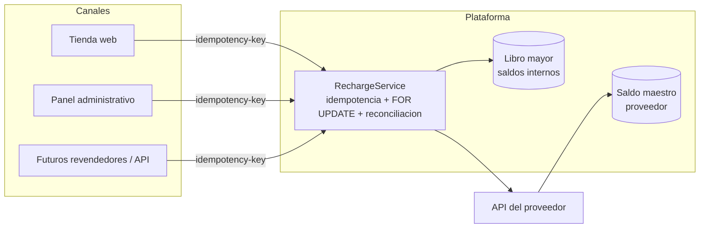

# Arquitectura de integración — web ↔ plataforma de recargas

## Problema

Hoy existen dos sistemas: la **tienda web** (cara al cliente) y la **plataforma
de recargas** (que posee el saldo prepago del proveedor y ejecuta las recargas).
Integrarlos **no** es que la web llame directo a la API del proveedor: eso
duplicaría la lógica de riesgo (idempotencia, bloqueo, reconciliación) y pondría
en peligro el saldo maestro desde dos lugares distintos.

## Principio

> Un **único** servicio de recarga toca el saldo maestro. Todos los canales
> (panel administrativo, tienda web, futuros revendedores) lo consumen a través
> de la misma costura, pasando una **clave de idempotencia**.

La web se convierte en **un canal más**, no en un segundo motor de recargas.



## Saldo interno separado del saldo maestro

La web **no** debita el saldo maestro del proveedor. Tiene su propio **saldo
interno** (por cliente o por revendedor), llevado como **libro mayor
append-only**: el saldo es la suma de asientos, nunca una columna mutable.

Flujo de una venta desde la web:

```mermaid
sequenceDiagram
    participant U as Cliente web
    participant W as Web (checkout)
    participant RS as RechargeService
    participant P as Proveedor

    U->>W: paga (cripto / saldo)
    W->>W: acredita saldo interno (asiento en libro mayor)
    W->>RS: recarga(order_id como idempotency-key)
    RS->>RS: INSERT idempotente + reserva FOR UPDATE
    RS->>P: charge(ref estable) — un intento
    alt ok
        P-->>RS: confirmado
        RS-->>W: confirmado (tx del proveedor)
        W->>W: debita saldo interno (asiento debito)
    else timeout
        RS->>RS: pending + reconciliacion asincrona
        RS-->>W: en proceso (idempotente; el reintento no recobra)
    end
```

Ventajas:

- El saldo maestro sólo se mueve dentro de `RechargeService`, con las tres
  defensas (idempotencia, bloqueo, reconciliación). **Una sola superficie de
  riesgo.**
- Si la web reintenta (timeout, refresh, doble clic), la `order_id` como clave de
  idempotencia garantiza **un solo cargo**.
- El libro mayor da trazabilidad total para auditoría y reportes.

## Cómo se organiza el código para crecer

- `RechargeService` como **servicio de aplicación** único (o módulo `Recharge`),
  independiente del canal que lo invoca.
- Contrato explícito (DTO de entrada/salida) → los canales no conocen los
  detalles internos.
- Cola (Redis/DB) para reconciliación y para absorber picos.
- Webhooks del proveedor **idempotentes y firmados**.
- Monolito modular al inicio (simple de operar); la costura permite extraer el
  módulo a un servicio aparte el día que el volumen lo justifique, sin reescribir
  los canales.
