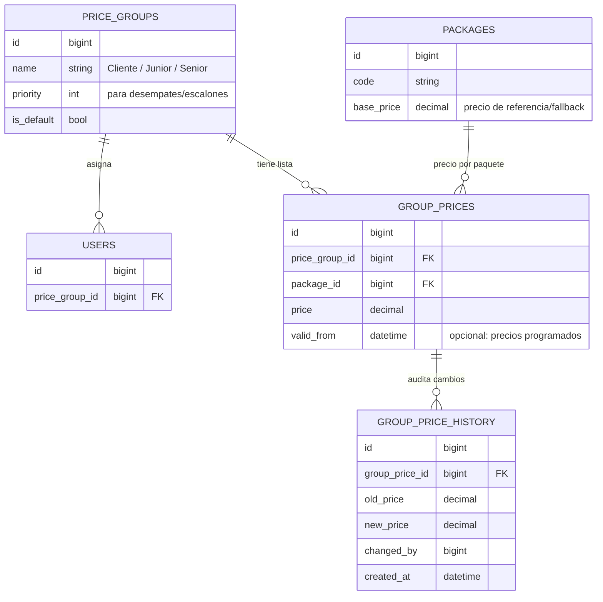

# Módulo de revendedores — grupos de precios

## Objetivo

Administrar precios **por grupo**, no por usuario. Asignar un usuario a un grupo
(Cliente, Revendedor Junior, Revendedor Senior…) y que automáticamente use la
lista de precios de ese grupo. Así se administran cientos de usuarios sin tocar
precios uno por uno.

## Modelo de datos



Claves de diseño:

- **`price_groups`** — cada grupo es una fila. Crear un grupo nuevo = una fila +
  su lista de precios. **No** requiere tocar código ni rediseñar nada.
- **`group_prices`** — la lista de precios: un precio por (grupo, paquete). Un
  índice único `(price_group_id, package_id)` evita duplicados.
- **`users.price_group_id`** — la asignación. Cambiar a un usuario de grupo es
  actualizar un campo; sus precios cambian solos.
- **`packages.base_price`** — precio de referencia usado como **fallback** si un
  grupo no define precio para ese paquete. Nunca hay un producto "sin precio".
- **`group_price_history`** — historial de cambios de precio, para auditoría y
  para el "historial de movimientos" del pliego.

## Resolución del precio

```
precio(usuario, paquete) =
    group_prices[ usuario.price_group_id, paquete ]   // si existe
    ?? packages.base_price[ paquete ]                 // fallback
```

En una consulta (sin lógica compleja por request):

```sql
SELECT COALESCE(gp.price, p.base_price) AS price
FROM packages p
LEFT JOIN group_prices gp
       ON gp.package_id = p.id
      AND gp.price_group_id = :userPriceGroupId
WHERE p.id = :packageId;
```

El precio ya viene filtrado por el grupo del usuario. En la web, al cargar el
catálogo, cada producto se muestra con el precio del grupo del usuario
autenticado (o el precio Cliente si es anónimo).

## Extensible sin rediseñar

El mismo esqueleto soporta reglas futuras **añadiendo**, no reescribiendo:

- **Descuentos por volumen** → tabla `group_volume_tiers (group_id, package_id,
  min_qty, price)`.
- **Límites de crédito / cupos por revendedor** → columnas en el saldo interno
  del revendedor (ver [arquitectura de integración](01-arquitectura-integracion.md)).
- **Precios programados / promociones** → `valid_from` / `valid_to` en
  `group_prices`.
- **Márgenes automáticos** → `group_prices.price` puede calcularse como
  `base_cost * (1 + margen_grupo)` en una tarea administrativa, manteniendo la
  misma tabla.

Ningún cambio anterior obliga a rediseñar el modelo: se agregan tablas o columnas
laterales y la resolución de precio sigue siendo la misma consulta con `COALESCE`.
